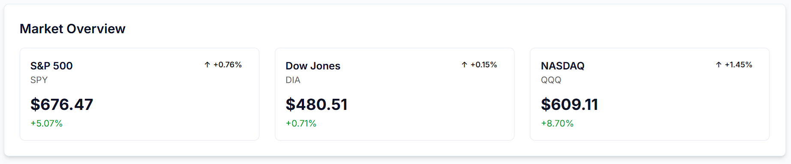
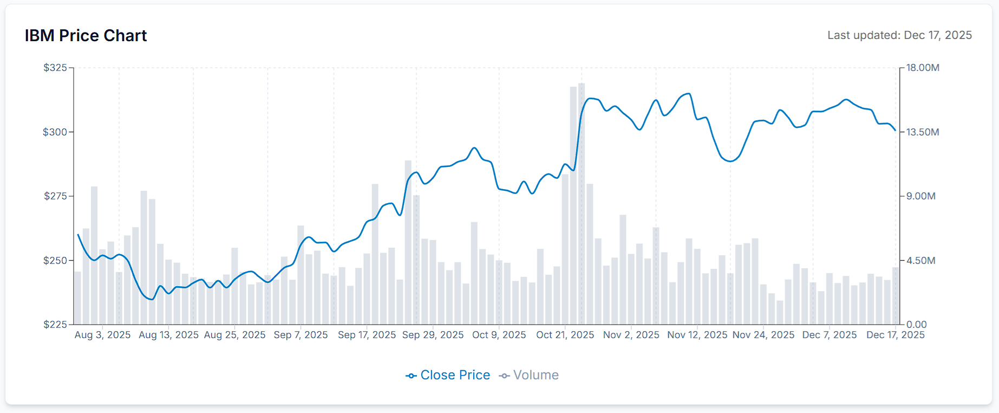
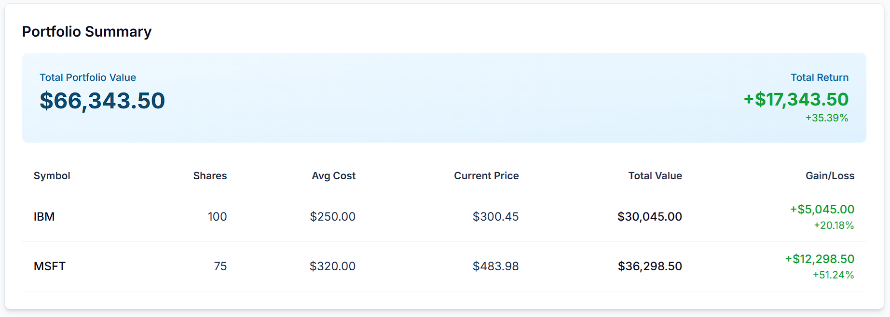

# Financial Dashboard

A React-based financial dashboard that provides real-time stock quotes, historical data, and market overview. The application demonstrates a **micro-frontend component architecture**, modular design, and a modern tech stack with TypeScript, Recoil, Tailwind CSS, and Recharts.

---

## Features

- **Portfolio Overview** – View real-time quotes and historical price trends for your stock portfolio.
- **Market Indices** – Track major market indices with automatic polling.
- **Stock Charts** – Interactive candlestick and line charts with volume bars.
- **Polling & Rate Limit Handling** – Automatic data refresh with smart handling of Alpha Vantage API rate limits.
- **Responsive Design** – Fully responsive UI using Tailwind CSS.

---

## Tech Stack

- **React 18** – Component-based UI library
- **TypeScript** – Static typing and type safety
- **Tailwind CSS** – Utility-first CSS framework for styling
- **Recoil** – State management (atoms and selectors for global state)
- **Recharts** – Data visualization for stock charts (candlestick, line charts, and volume)
- **Axios** – API requests
- **Alpha Vantage API** – Stock quotes and historical time series
- **Micro-frontend component architecture** – Modular, self-contained components for scalable frontends
- **Jest + React Testing Library** – Unit and integration testing

---

## Architecture Overview

Data Flow Diagram:

  +----------------+       +----------------+       +----------------+
  | PortfolioState | ----> | usePollingData | ----> | StockChart     |
  +----------------+       +----------------+       +----------------+
          |                         |
          v                         v
  +----------------+       +----------------+
  | MarketIndices  |       | useStockData   |
  +----------------+       +----------------+

**Explanation:**

- **PortfolioState & MarketIndices** – Recoil atoms store global state for portfolio holdings and index data.
- **usePollingData** – Custom hook that polls Alpha Vantage API for live quotes with rate-limit handling.
- **useStockData** – Custom hook for fetching detailed stock data and historical prices.
- **StockChart** – Recharts component that renders line/candlestick charts and volume bars, using memoized data for performance.

---

## Screenshots

**Market Indices:**

**Stock Chart:**

**Portfolio Overview:**

---

## Getting Started

1. **Clone this repository:**
   git clone https://github.com/yourusername/financial-dashboard.git
    cd financial-dashboard

2. **Install dependencies:**
   npm install

3. **Set up environment variables:**
   Create a `.env` file in the root:

        # Alpha Vantage API Configuration
        REACT_APP_ALPHAVANTAGE_API_KEY=your_api_key_here
        REACT_APP_ALPHAVANTAGE_BASE_URL=https://www.alphavantage.co/query
    
        # FinnHubb API Configuration
        REACT_APP_FINNHUB_API_KEY=your_api_key_here
        REACT_APP_FINNHUB_BASE_URL=https://finnhub.io/api/v1/quote

        # Portfolio Configuration (Format: SYMBOL:SHARES:AVG_COST)
        REACT_APP_PORTFOLIO=IBM:100:250,MSFT:75:320

        # Delay (ms) between API calls to respect Alpha Vantage free tier limit of 5 requests per minute
        REACT_APP_RATE_LIMIT_DELAY_MS = 12000;
        
        # Quote cache freshness window (ms)
        REACT_APP_QUOTE_TTL_MS=60000

        # Portfolio polling Interval (ms)
        REACT_APP_PORTFOLIO_POLLING_INTERVAL_MS=120000

        # Environment
        REACT_APP_ENV=development

4. **Run the development server:**
   npm start

5. **Run tests:**
   npm test

---

## Folder Structure

financial-dashboard/
├── public/             # Static files
├── src/
│   ├── components/     # React components
│   │   ├── Dashboard/
│   │   ├── Layout/
│   │   ├── MarketOverview/
│   │   ├── PortfolioSummary/
│   │   └── StockChart/
│   ├── hooks/          # Custom hooks (usePollingData, usePortfolioData, etc.)
│   ├── services/       # API services (Alpha Vantage)
│   ├── state/          # Recoil atoms and selectors
│   ├── types/          # TypeScript type definitions
│   └── utils/          # Utility functions (calculations, formatters)
├── .gitignore
├── package.json
├── README.md
├── tailwind.config.js
└── tsconfig.json

---

## Notes

- This project respects Alpha Vantage free tier rate limits by delaying requests between symbols.
- Charts are rendered using Recharts with memoized data processing for performance.
- State management is handled by Recoil for global atoms and selectors.
- Micro-frontend architecture allows independent, reusable components.
- Includes basic unit and integration tests using Jest and React Testing Library.

---

## License

This project is licensed under the MIT License. See the LICENSE file for details.
